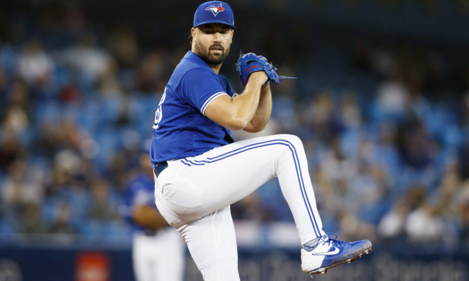

# Análisis de la eficiencia de los Lanzamientos de los Cy-Youngs (2020,2021)

|  | 
|:--:| 
| *Photo by Cole Burston/Getty Images* |

A propósito del inico de la temporada 2022 de la MLB, un interesante ejercicio sabermétrico puede ser mirar el trabajo hecho por lo mejores lanzadores de la liga, que según la BBWAA fueron, en la temporada 2021, Robie Ray (Azulejos de Toronto) y Corbin Burnes (Cerveceros de Milwaukee), y en la temporada anterior, Shane Biever (Indios de Cleveland) y Trevor Bauer (Rojos de Cincinati). 

En este repositorio se analizan los tipos de picheos que usan estos lanzadores y los resultados que con ellos logran, que van desde strike hasta jonrones; así como también, las formas de los batazos que los bateadores logran realizar por ejemplo: rolings, lineas, flyes, etc. 

Se destaca el uso en este notebook, de librerías de python tan útiles como pandas, matplotlib, seaborn y de especial apoyo pybaseball desarrollado por [Moshe Eschorr](https://github.com/schorrm) con el que se realiza el scrap de la data desde [baseballsavant](https://baseballsavant.mlb.com/statcast_search). De igual forma la librería ipywidget permitió desarrollar algunas interactividades. 

En el enlace de abajo podrás exprimentar con este notebook desde myBinder.

*En la memoria de mi padre Agustín Romero, quién esperaba el OpenDay como mucha espectativa, le llamaban: "EL Big Leaguer"*
